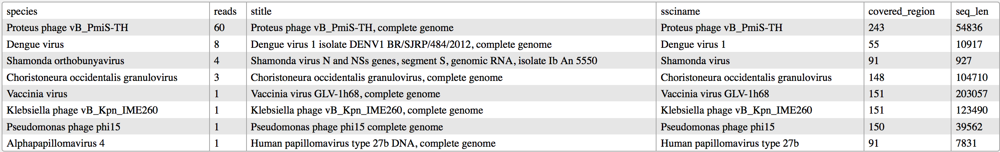

VirMet
------

Watch out: only a few files are counted in coverage statistics.

Full documentation on [Read the Docs](http://virmet.rtfd.org/en/latest/).

A set of tools for viral metagenomics.

virmet is called with a command subcommand
syntax: `virmet fetch --viral n`, for example, downloads the bacterial
database. Other available subcommands so far are

- `fetch`               download genomes
- `update`              update viral/bacterial database
- `index`               index genomes
- `wolfpack`            analyze a Miseq run
- `covplot`             plot coverage for a specific organism

A short help is obtained with `virmet subcommand -h`.

#### The simplest example

    [user@host ~]$ virmet wolfpack --run path_to_run_directory
    ... some time later ...
    [user@host ~]$ wc virmet_output_name_of_the_run/sample_name/orgs_list.csv
       9     128     963 orgs_list2.tsv

Reads are filtered, decontaminated, and finally blasted against a (large)
set of viral sequences. Results for each database sequence to which similar reads
were found are summarised in a tsv file is with columns

- `species`: scientific name of the species corresponding to the database sequence;
- `reads`: number of reads assigned to this specific sequence;
- `stitle`: title of the sequence in the database (fasta header);
- `ssciname`: scientific name of the sequence;
- `covered_region`: number of nucleotides covered by at least one read;
- `seq_len`: length of the sequence.

An example of such a file is reported here.

### Installation

#### Bioconda

VirMet is available through [Bioconda](https://bioconda.github.io), a channel
for the [conda](http://conda.pydata.org/docs/intro.html) package manager. Once
conda is [installed](https://bioconda.github.io/#install-conda) and the
[channels](https://bioconda.github.io/#set-up-channels) are set up,
`conda install virmet` installs the package with all its dependencies.

#### `setuptools` or Docker

The classic `python setup.py install` will work, but see the relevant
[page](http://virmet.readthedocs.io/en/latest/installation/) of the
documentation to install third-party tools, or follow the instructions
to run the [docker version](http://virmet.readthedocs.io/en/latest/dockerised/).

### Preparation

VirMet contains programs to download and index the genome sequences,
instructions [here](http://virmet.readthedocs.io/en/latest/preparation/).

### Running a virus scan

This can be run on a single file or on a directory. It will try to guess from
the naming scheme if it is a Miseq output directory (_i.e._ with
`Data/Intensities/BaseCalls/` structure) and analyze all fastq files in there.
The extension must be `.fastq` or `.fastq.gz`. It will then run a filtering
step based on quality, length and entropy (in short: reads with a lot of
repeats will be discarded), followed by a decontamination step where reads
of human/bacterial/bovine/fungal origin will be discarded. Finally, remaining
reads are _blasted_ against the viral database. The list of organisms with the
count of reads is in files `orgs_list.csv` in the output directory
(naming is `virmet_output_...`). For example, if we have a directory named
`exp_01` with files

    exp_01/AR-1_S1_L001_R1_001.fastq.gz
    exp_01/AR-2_S2_L001_R1_001.fastq.gz
    exp_01/AR-3_S3_L001_R1_001.fastq.gz
    exp_01/AR-4_S4_L001_R1_001.fastq.gz

we could run

    [user@host test_virmet]$ virmet wolfpack --dir exp_01

and, after some time, find the results in `virmet_output_exp01`. Many files are
present, the most important ones being `orgs_list.csv` and `stats.tsv`. The
first lists the viral organisms found with a count of reads that could be
matched to them.

    [user@host test_virmet]$ cat virmet_output_test_dir_150123/3-1-65_S5/orgs_list.tsv
    organism	reads
    Human adenovirus 7	126
    Human poliovirus 1 strain Sabin	45
    Human poliovirus 1 Mahoney	29
    Human adenovirus 3+11p	19
    Human adenovirus 16	1

The second file is a summary of all reads analyzed for this sample and how many
were passing a specific step of the pipeline or matching a specific database.

    [user@host test_virmet]$ cat virmet_output_exp01/AR-1_S1/stats.tsv
    raw_reads       6250
    trimmed_too_short       462
    low_entropy     1905
    low_quality     0
    passing_filter  3883
    matching_humanGRCh38    3463
    matching_bact1  0
    matching_bact2  0
    matching_bact3  0
    matching_fungi1 0
    matching_bt_ref 0
    reads_to_blast  420
    viral_reads     257
    undetermined_reads      163

### Updating the database

More and more sequences are uploaded to NCBI database every month. The figure
shows the number of viral sequences with _complete genome_ in the title
that are submitted every month to NCBI ([code](https://gist.github.com/ozagordi/c1e1c4158ab4e94e4683)).

](./docs/viral_genomes.png "NCBI complete viral genomes per month")

VirMet provides a simple way to [update the viral database](http://virmet.readthedocs.io/en/latest/updating/).
