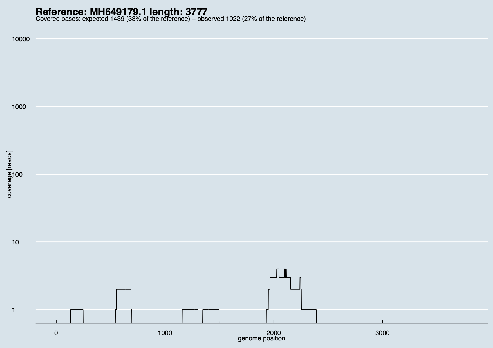

# Inspecting the results: `covplot`

## Covplot

After a run of [`Wolfpack`](./Wolfpack.md), the `orgs_list.tsv` files show
how many reads per sample are assigned to a given viral organism, and 
(unless `--nocovplot` is requested), the tool also creates coverage plots
for a few viral organisms of interest, given that:

* ≥3 sequencing reads match a specific viral organism.
* The weighted mean coverage score for a viral organism is ≥10%.
* The viral organism is not a phage nor a non-human virus.

See documentation of [Virus scan](./Wolfpack.md) for more information.

In some cases, however, users may be interested in generating coverage plots
of other viral organisms, even if such organisms don't meet the mentioned criteria.

For that, they can use the subcommand `virmet covplot`. 
Information on how to use it can be obtained with `-h`:

```
virmet covplot -h
usage: virmet covplot [options]

Options:
  -h, --help           show this help message and exit
  --outdir [OUTDIR]    path to store the coverage plots
  --organism ORGANISM  ssciname of the organism of interest
  --dbdir [DBDIR]      path to find and use the Virmet database

```

Importantly, users must specify the `virmet_output_RUN_NAME/SAMPLE_NAME` with
 `--outdir`. Otherwise, VirMet doesn't know where to look for the analysed
mNGS outputs. The resulting coverage plots will be saved in the same folder.

Covplot also requires users to specify the `ssciname` of the organism of
interest, which can be found in the `orgs_list.tsv` file.

To create coverage plots, VirMet will assume that the viral database
is stored into `/data/virmet_databases` and follows the usual VirMet
structure. If another path should be considered, users must specify it with
`--dbdir`.

## Example

As an example, let's suppose users want to investigate sample `ABC-DNA_S9` in the
directory `virmet_output_Exp01`. First, they go to the directory
`virmet_output_Exp01/ABC-DNA_S9` and check which coverage plots have already
been created automatically by [VirMet Wolfpack](./Wolfpack.md).

They see the following:

```
virmet_output_Exp01/
├── ABC-DNA_S9
│   ├── Virus_X/
│   │    └── Virus_X_coverage.pdf
│   ├── unique.tsv.gz, viral_reads.fastq.gz, undetermined_reads.fastq.gz
│   ├── orgs_list.tsv, stats.tsv, fastp.html
│   └── Others.err
├── run_reads_summary.tsv
└── orgs_species_found.tsv
```

After that, users may inspect the `orgs_list.tsv` file and look for
any other interesting viruses that didn't meet the above criteria but may
still be worth considering.

```
species             accn        reads  stitle	           ssciname	              covered_region  seq_len
Tunavirus T1	    MK213796.1  455	   Phage T1            Escherichia phage T1	  30152	          48836
Virus X	            XX123412.1  79	   Virus X, isolate R  Virus X	              321	          137741
Coronavirus BCoV    XX000111.1  40	   Coronavirus ABC     Bovine coronavirus	  141	          9372
```

Users know that Virus X seems to be a good candidate and inspect the created coverage plot (`Virus_X_coverage.pdf`).
However, they think that Bovine Coronavirus may also be interesting.

Therefore, they run:

```virmet covplot --outdir virmet_output_Exp01/ABC-DNA_S9 --organism "Bovine coronavirus" ```.

The subcommand `covplot` will perform the following steps:

1. Identify all mappings read-organism *where the organism name starts with "Bovine coronavirus"*,
2. Identify the genome (or strain of this organism) with the highest number of reads mapped,
3. Align *all viral reads* to it,
4. Compute the coverage, write it to `depth.txt` and plot it.

The final result is a pdf file with the name `Bovine_coronavirus_coverage.pdf`, saved into:

```virmet_output_Exp01/ABC-DNA_S9/Bovine_coronavirus```.

This allows users to see how reads spread across the genome of this virus and to determine
whether it could be a true positive or whether it is just an artifact or contamination.

An example of a coverage plot generated by VirMet would be the following:

{: style="display:block; margin-left:auto; margin-right:auto; width:75%;" }